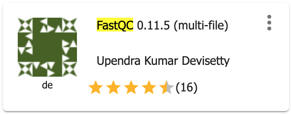

.. include:: cyverse_rst_defined_substitutions.txt

|CyVerse logo|_

|Home_Icon|_
`Learning Center Home <http://learning.cyverse.org/>`_

**Sample dataset and preprocessing**
----------------------------------------

We are analyzing Fumarate and nitrate reduction (FNR) transcription factor dataset in this tutorial (Myers et al., 2013). FNR transcription factor controls the expression of over 100 target genes in response to anoxia. It facilitates the adaptation to anaerobic growth conditions by regulating the expression of gene products that are involved in anaerobic energy metabolism. We will use the FNR IP ChIP-seq Anaerobic A (GSM1010219) dataset and compare this with the control sample (GSM1010224).

----------------------------------------

**Input Data:**

.. list-table::
    :header-rows: 1

    * - Input
      - Description
      - Location
    * - FNR transcription factor data 
      - FNR IP ChIP-seq and INPUT DNA in anaerobic condition
      - iplantcollaborative > example_data > chipseq_webinar -> fastqfiles

**Preprocessing**

*Evaluate the quality of your sequencing data using FastQC*

Preprocessing of ChIP-seq data is similar to that of any other sequencing data and will assess the quality of the raw reads to identify possible sequencing errors or biases. FastQC can be used for an overview of the data quality but this does not assess if your ChIP experiment has worked. We will assess that in Step4- Postprocessing- ChIP quality assessment.

1. Login to the |discovery_enviornment|.

2. CLick on "Apps" tab in the Discovery Environment and search for "fastqc".

3. Click on the app icon.

|fastqc_app_icon|_

4. Change the name of the analysis and output folder as needed or leave for defaults.

5. Under "Input" click on Add to provide input files for both ChIP and input dataset. Sample dataset location iplantcollaborative > example_data > chipseq_webinar -> fastqfiles. Check both files (SRR576933_IP.fastq, SRR576938_input.fastq) and click 'OK'. 

6. For next section "Resource Requirements" request resources as needed or leave for defaults 

7. Click **Launch Analysis**. You will receive a notification that the job has been submitted and running. Click on the Analyses tab to check the status of your job. When the analysis completes, click on the right three dots menu and click on 'Go to output folder' to access you output files.

**Output/Results**

.. list-table::
    :header-rows: 1

    * - Output
      - Description
      - Example
    * - html and zip files
      - FastqQC report
      - SRR576933_IP_fastqc.html

----

**Description of output and results**

Click on the html report files and check if your sequencing data has any red flags that you should be aware of. There are few red flags in the report. You will notice that "Per base sequence quality" decrease towards the end of the reads which is usual with illumina sequencing. Other useful metrices that should be checked for ChIP-seq data are: sequence duplication levels and over-represented sequences. 

As this report does not present any major concerns regarding the quality of this dataset, we will proceed with the next step i.e, reads alignment. However, for your own data, it is a good pratice to rerun fastqc after quality filtering your reads: remove adapter sequences and low-quality bases (Phred quality score< 20 indicates error rate >1%) and discard any short reads after trimming (<20bp reads). Check |trim_app| in CyVerse DE which can be used to trim and crop Illumina (FASTQ) data as well as to remove adapters.

For more details on each module of the fastqc report, check |fastqc_doc| 

----

**Fix or improve this documentation**

Search for an answer:
|CyVerse Learning Center| or
|CyVerse Wiki|

----

|Home_Icon|_
`Learning Center Home <http://learning.cyverse.org/>`_

.. Comment: Place Images Below This Line
   use :width: to give a desired width for your image
   use :height: to give a desired height for your image
   replace the image name/location and URL if hyperlinked

 .. |Clickable hyperlinked image| image:: ./img/IMAGENAME.png
    :width: 500
    :height: 100
 .. _CyVerse logo: http://learning.cyverse.org/

 .. |Static image| image:: ./img/IMAGENAME.png
    :width: 25
    :height: 25

.. Comment: Place URLS Below This Line

   # Use this example to ensure that links open in new tabs, avoiding
   # forcing users to leave the document, and making it easy to update links
   # In a single place in this document

   .. |Substitution| raw:: html # Place this anywhere in the text you want a hyperlink

      <a href="REPLACE_THIS_WITH_URL" target="blank">Replace_with_text</a>

.. |Github Repo Link|  raw:: html

   <a href="FIX_FIX_FIX_FIX_FIX_FIX_FIX_FIX_FIX_FIX_FIX_FIX_FIX_FIX_FIX" target="blank">Github Repo Link</a>

.. |discovery_enviornment| raw:: html

    <a href="https://de.cyverse.org/de/" target="_blank">Discovery Environment</a>

.. _fastqc_app_icon: http://learning.cyverse.org/ <a href="https://de.cyverse.org/de/" target="_blank">fastqc_app_icon</a>

.. |trim_app| raw:: html

    <a href="https://de.cyverse.org/de/?type=apps&app-id=92578d70-54b0-11e9-ae6e-008cfa5ae621&system-id=de" target="_blank">Trimmomatic app</a>

.. |fastqc_doc| raw:: html

    <a href="https://www.bioinformatics.babraham.ac.uk/projects/fastqc/Help/3%20Analysis%20Modules/" target="_blank">FastQC documentation</a>

