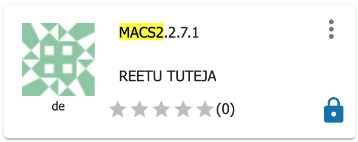

.. include:: cyverse_rst_defined_substitutions.txt

|CyVerse_logo|_

|Home_Icon|_
`Learning Center Home <http://learning.cyverse.org/>`_

**Peak calling**
------------------

In this step, we will use bowtie alignment files to perform peak calling. Peak calling programs identify set of read enriched regions in the genome that represent binding sites from your protein of interest. We will be using MACS2 (Model-based Analysis for ChIP-seq) app in CyVerse DE for peak identification.

----

**Input Data:**

.. list-table::
    :header-rows: 1

    * - Input
      - Description
      - Location
    * - Bowtie output files
      - Alignment files
      - iplantcollaborative > example_data > chipseq_webinar -> bowtie_output

**Run MACS2 in the CyVerse Discovery Environment**

1. Click on "Apps" tab in the Discovery Environment and search for "macs2".

2. Click on the app icon.

|macs2_app_icon|_

3. Change the name of the analysis and output folder as needed or leave for defaults.

4. Under Callpeaks input section, browse the treatment and control files from the datastore. Provide experiment name 'ecoli'.

    Example treatment file- iplantcollaborative > example_data > chipseq_webinar -> bowtie_output -> bowtieout_chipIP.sam

    Example control file- iplantcollaborative > example_data > chipseq_webinar -> bowtie_output -> bowtieout_input.sam

5. Provide mappable genome size- 'gsize 4639675' for E. coli genome. Leave the rest of the parameters to defaults. For next section "Resource Requirements" request resources as needed or leave for defaults. Click on Launch Analysis.

6. Click on the Analyses to check the status of your job. When the analysis completes, click on the right three dots menu and click on 'Go to output folder' to access you output files.

**Should you discard duplicate reads before peak identification?**

Best practice is to remove duplicates prior to peak calling. MACS2 default is to keep a single read at each location but provides different options to deal with duplicates. Bona fide peaks will have multiple overlapping reads with offsets, while samples with only PCR duplicates will stack up perfectly without offsets. These duplicates can arise from experimental artifacts, but can also contribute to true ChIP-signals.

.. note::

  The bad kind of duplicates: If initial starting material is low this can lead to overamplification of this material before sequencing. Any biases in PCR will compound this problem and can lead to artificially enriched regions. Also blacklisted (repeat) regions with ultra high signal will also be high in duplicates. Masking these regions prior to analysis can help remove this problem.

  The good kind of duplicates: You can expect some biological duplicates with ChIP-seq since you are only sequencing a small part of the genome. This number can increase if your depth of coverage is excessive or if your protein only binds to few sites. If there are a good proportion of biological dupicates, removal can lead to an underestimation of the ChIP signal (Credits: HBC ChIP-seq workshop for summarizing this info)

..
	#### Comment: Suggested style guide:
	1. Steps begin with a verb or preposition: Click on... OR Under the "Results Menu"
	2. Locations of files listed parenthetically, separated by carets, ultimate object in bold
	(Username > analyses > *output*)
	3. Buttons and/or keywords in bold: Click on **Apps** OR select **Arabidopsis**
	4. Primary menu titles in double quotes: Under "Input" choose...
	5. Secondary menu titles or headers in single quotes: For the 'Select Input' option choose...
	####

**Output/Results**

.. list-table::
    :header-rows: 1

    * - Output
      - Description
      - Example
    * - NAME_peaks.narrowPeak
      - Contains the peak locations and other information
      - ecoli_peaks.narrowPeak
    * - NAME_peaks.xls
      - Tabular file which contains information about called peaks
      - ecoli_peaks.xls
    * - NAME_summits.bed
      - Peak summits locations for every peak
      - ecoli_summits.bed

----

**Description of output and results**

We will be using ecoli_peaks.narrowPeak output file for further analysis. For more information on MACS2 parameters and output files, check the github read me for MACS2 https://github.com/taoliu/MACS.

Brief description of narrowpeak output file format (BED6+4 format):

Col1- name of the chromosome

Col2- Peak start position

Col3- Peak end position

Col4- Peak name

Col5- Peak score

Col6- Strand

Col7- Fold enrichment

Col8- log10.pvalue

Col9- log10.qvalue

Col10- peak

For more information about BED format, check |bed_here| 

.. Note::

  MACS2 mfold parameter specifies an interval of high-confidence enrichment ratio against the background on which to build the model. The default value 10, 30 means that a model will be built on the basis of regions having read counts that are 10- to 30-fold of the background. Check the effect of changing mfold range to 5,30 on number of resulting peaks.

----

**Fix or improve this documentation**

- Search for an answer:
  |CyVerse Learning Center|
- Ask us for help:
  click |Intercom| on the lower right-hand side of the page
- Report an issue or submit a change:
  |Github Repo Link|
- Send feedback: `Tutorials@CyVerse.org <Tutorials@CyVerse.org>`_

----

|Home_Icon|_
`Learning Center Home <http://learning.cyverse.org/>`_

.. Comment: Place Images Below This Line
   use :width: to give a desired width for your image
   use :height: to give a desired height for your image
   replace the image name/location and URL if hyperlinked

 .. |Clickable hyperlinked image| image:: ./img/IMAGENAME.png
    :width: 500
    :height: 100
 .. _CyVerse logo: http://learning.cyverse.org/

 .. |Static image| image:: ./img/IMAGENAME.png
    :width: 25
    :height: 25

.. Comment: Place URLS Below This Line

   # Use this example to ensure that links open in new tabs, avoiding
   # forcing users to leave the document, and making it easy to update links
   # In a single place in this document

   .. |Substitution| raw:: html # Place this anywhere in the text you want a hyperlink

      <a href="REPLACE_THIS_WITH_URL" target="blank">Replace_with_text</a>

.. |Github Repo Link|  raw:: html

   <a href="FIX_FIX_FIX_FIX_FIX_FIX_FIX_FIX_FIX_FIX_FIX_FIX_FIX_FIX_FIX" target="blank">Github Repo Link</a>

.. |discovery_enviornment| raw:: html

    <a href="https://de.cyverse.org/de/" target="_blank">Discovery Environment</a>

.. _macs2_app_icon: http://learning.cyverse.org/ <a href="https://de.cyverse.org/de/" target="_blank">macs2_app_icon</a>

.. |bed_here| raw:: html

    <a href="https://genome.ucsc.edu/FAQ/FAQformat.html#format12" target="_blank">here</a>
