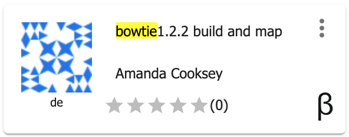

.. include:: cyverse_rst_defined_substitutions.txt

|CyVerse logo|_

|Home_Icon|_
`Learning Center Home <http://learning.cyverse.org/>`_

**Read mapping**
------------------

We will next align our reads to the E. coli reference genome. Any standard short-read alignment program such as BWA, Bowtie can be used for this step. We will use Bowtie 1 for aligning our reads. For short reads (< 50bp), Bowtie 1 is faster and sensitive than Bowtie2.

----

**Input Data:**

.. list-table::
    :header-rows: 1

    * - Input
      - Description
      - Location
    * - Sequence reads
      - Raw or quality filtered reads 
      - iplantcollaborative > example_data > chipseq_webinar -> fastqfiles

****Run Bowtie 1 in the CyVerse Discovery Environment****

1. Click on "Apps" tab in the Discovery Environment and search for "bowtie".

2. Click on the app icon. Bowtie build and map app builds a bowtie index and then maps reads.

|bowtie1_app_icon|_

3. Change the name of the analysis and output folder as needed or leave for defaults.

4. Under bowtie build Input section provide Reference genome file in Fasta format. Browse through the datastore and provide GCF_000005845.2_ASM584v2_genomic.fna Ecoli reference genome. This file is provided with the sample dataset- iplantcollaborative > example_data > chipseq_webinar -> ecoli_refgenome.

5. Under bowtie build Output section provide name of the basename for index 'ecoli'. Under bowtie map- reference inputs section provide the same name for the index base name 'ecoli'.

6. Under bowtie map read Input section provide the ChIP sequence reads file SRR576933_IP.fastq. Input data location- iplantcollaborative > example_data > chipseq_webinar -> fastqfiles.

7. Provide an output file name and click on the Analyses to check the status of your job. When the analysis completes, click on the right three dots menu and click on 'Go to output folder' to access you output files. Repeat the same steps for control dataset SRR576933_control.fastq

**Sequencing depth**

Effective analysis of ChIP-seq data requires sufficient coverage by sequence reads (sequencing depth). The required depth depends mainly on the size of the genome and the number and size of the binding sites of the protein. ENCODE’s guidelines is to obtain minimum 10 million uniquely mapping reads per replicate experiment for mammalian genomes (Landt et al, 2009). 

.. note::

  If atleast 10 million uniquely mapping reads are required for human genome. How many minimum reads are required for E. coli dataset to have sufficent coverage for further analysis?

**Output/Results**

.. list-table::
    :header-rows: 1

    * - Output
      - Description
      - Example
    * - Alignment files
      - Alignment files in SAM format
      - bowtieout_control.sam

----

**Description of output and results**

----

**Fix or improve this documentation**

Search for an answer:
|CyVerse Learning Center| or
|CyVerse Wiki|

----

|Home_Icon|_
`Learning Center Home <http://learning.cyverse.org/>`_

.. Comment: Place Images Below This Line
   use :width: to give a desired width for your image
   use :height: to give a desired height for your image
   replace the image name/location and URL if hyperlinked

 .. |Clickable hyperlinked image| image:: ./img/IMAGENAME.png
    :width: 500
    :height: 100
 .. _CyVerse logo: http://learning.cyverse.org/

 .. |Static image| image:: ./img/IMAGENAME.png
    :width: 25
    :height: 25

.. Comment: Place URLS Below This Line

   # Use this example to ensure that links open in new tabs, avoiding
   # forcing users to leave the document, and making it easy to update links
   # In a single place in this document

   .. |Substitution| raw:: html # Place this anywhere in the text you want a hyperlink

      <a href="REPLACE_THIS_WITH_URL" target="blank">Replace_with_text</a>

.. |Github Repo Link|  raw:: html

   <a href="FIX_FIX_FIX_FIX_FIX_FIX_FIX_FIX_FIX_FIX_FIX_FIX_FIX_FIX_FIX" target="blank">Github Repo Link</a>

.. _bowtie1_app_icon: http://learning.cyverse.org/ <a href="https://de.cyverse.org/de/" target="_blank">bowtie1_app_icon</a>