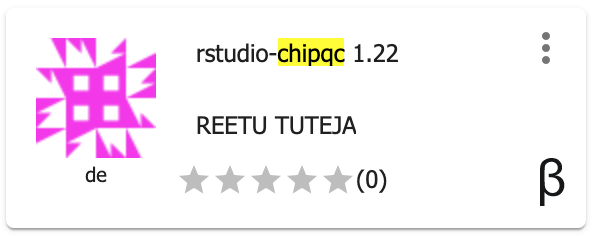

.. include:: cyverse_rst_defined_substitutions.txt

|CyVerse logo|_

|Home_Icon|_
`Learning Center Home <http://learning.cyverse.org/>`_

**Postprocessing- ChIP quality assessment**
--------------------------------------------

The quality of a ChIP experiment largely depends on the specificity of the antibody and the degree of enrichment achieved in the affinity precipitation step. In this section, we will use ChIPQC R package to calculate cross-correlation and FRiP score to assess quality of our ChIP data. FRiP stands for Fraction of Reads in Peaks. As per ENCODE guidelines, FRiP% values around 5% or higher generally reflect successful enrichment (Landt et al., 2012).

----

**Input Data:**

.. list-table::
    :header-rows: 1

    * - Input
      - Description
      - Location
    * - Alignment file
      - alignment file in bam format
      - iplantcollaborative > example_data > chipseq_webinar -> bowtie_output
    * - Identified peaks
      - MACS2 output
      - iplantcollaborative > example_data > chipseq_webinar -> macs2_output

**Run Rstudio-chipqc app in CyVerse DE**

1. CLick on "Apps" tab in the Discovery Enviornment and search for "rstudio-chipqc".

2. Click on the app icon.

|chipqc_icon|_

3. Change the name of the analysis and output folder as needed or leave for defaults.

4. Under "Input" provide the path for the folder for your input files. This will make your input dataset available in rstudio workspace.

5. Under "Resource Requirements" request resources as needed or leave for defaults 

6. Click **Launch Analysis**. You will receive a notification that the job has been submitted and running. Click on 'Access your analysis here' link.

7. Once the analysis is launched, provide username (rstudio) and password (rstudio1) for rstudio. Analysis may take few minutes to launch, depends on the size of your input data.

8. Use the following script to calculate FRiP percentage and cross-correlation for one sample using ChIPQCsample function. Check ChIPQC package documentation |chiqcdoc| for more details.

.. code::

  library(ChIPQC)
  exampleExp <- ChIPQCsample(bamFiles,peaks=mypeaks)

  mypeaks <- read.delim("ecoli_peaks.narrowPeak", header=F)

  QCmetrics(exampleExp)
  plotFrip(exampleExp)
  frip(exampleExp)
  plotCC(exampleExp)

.. Note::

  ChIPQC package accepts sorted BAM files as input. A sorted BAM file is a compressed binary version of a SAM file that has reads sorted by coordinates. Reads from the beginning of the first chromosome are found first in the coordinate sorted alignment file. You can use Samtools SAM to sorted BAM |app_link| in the DE to convert SAM to sorted BAM files.

----

**Fix or improve this documentation**

Search for an answer:
|CyVerse Learning Center| or
|CyVerse Wiki|

----

|Home_Icon|_
`Learning Center Home <http://learning.cyverse.org/>`_

.. Comment: Place Images Below This Line
   use :width: to give a desired width for your image
   use :height: to give a desired height for your image
   replace the image name/location and URL if hyperlinked

 .. |Clickable hyperlinked image| image:: ./img/IMAGENAME.png
    :width: 500
    :height: 100
 .. _CyVerse logo: http://learning.cyverse.org/

 .. |Static image| image:: ./img/IMAGENAME.png
    :width: 25
    :height: 25

.. Comment: Place URLS Below This Line

   # Use this example to ensure that links open in new tabs, avoiding
   # forcing users to leave the document, and making it easy to update links
   # In a single place in this document

   .. |Substitution| raw:: html # Place this anywhere in the text you want a hyperlink

      <a href="REPLACE_THIS_WITH_URL" target="blank">Replace_with_text</a>

.. |Github Repo Link|  raw:: html

   <a href="FIX_FIX_FIX_FIX_FIX_FIX_FIX_FIX_FIX_FIX_FIX_FIX_FIX_FIX_FIX" target="blank">Github Repo Link</a>

.. _bowtie1_app_icon: http://learning.cyverse.org/ <a href="https://de.cyverse.org/de/" target="_blank">chipqc_icon</a>

.. |chiqcdoc| raw:: html

    <a href="https://bioconductor.org/packages/release/bioc/vignettes/ChIPQC/inst/doc/ChIPQC.pdf" target="_blank">here</a>

.. |app_link| raw:: html

    <a href="https://de.cyverse.org/de/?type=apps&app-id=b072aba4-3f59-11e8-8ce3-008cfa5ae621&system-id=de" target="_blank">App</a>
